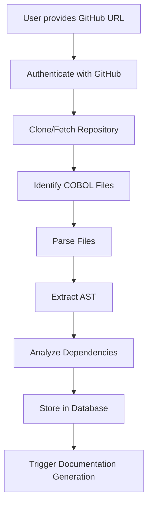
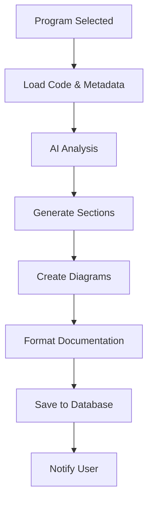
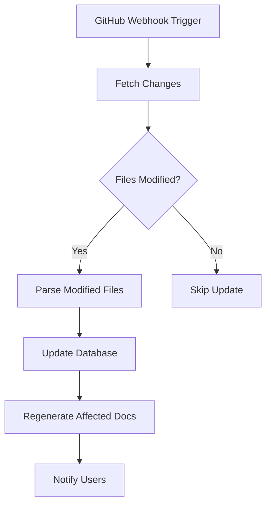

# COBOL Documentation Platform - Technical Specification

## 1. System Architecture Overview

### 1.1 Core Components

```
┌─────────────────────────────────────────────────────────────────┐
│                        Frontend (React/TypeScript)               │
├─────────────────────────────────────────────────────────────────┤
│                     API Gateway (Express.js)                     │
├─────────────────────────────────────────────────────────────────┤
│  ┌──────────────┬──────────────┬──────────────┬──────────────┐ │
│  │   GitHub     │    Parser    │      AI      │  Document    │ │
│  │ Integration  │    Engine    │   Services   │  Generator   │ │
│  └──────────────┴──────────────┴──────────────┴──────────────┘ │
├─────────────────────────────────────────────────────────────────┤
│                     PostgreSQL Database                          │
└─────────────────────────────────────────────────────────────────┘
```

### 1.2 Module Definitions

#### A. GitHub Integration Module
- **Purpose**: Connect to GitHub repositories and manage code synchronization
- **Components**:
  - Repository connector (OAuth/PAT authentication)
  - Webhook handler for auto-updates
  - Branch/commit tracking
  - File fetcher and cache manager

#### B. Parser Engine
- **Purpose**: Parse and analyze COBOL code structure
- **Components**:
  - COBOL lexer/tokenizer
  - AST builder
  - Section identifier
  - Dependency analyzer
  - Business logic extractor

#### C. AI Services
- **Purpose**: Generate intelligent documentation and insights
- **Components**:
  - Claude API integration (primary)
  - Gemini API integration (secondary)
  - Prompt engineering system
  - Context management
  - Batch processing queue

#### D. Document Generator
- **Purpose**: Create formatted documentation outputs
- **Components**:
  - Mermaid diagram generator
  - Markdown formatter
  - PDF exporter
  - HTML builder
  - Decision tree visualizer

## 2. Data Models

### 2.1 Core Entities

```typescript
// Repository
interface Repository {
  id: number;
  githubUrl: string;
  owner: string;
  name: string;
  branch: string;
  lastSyncedCommit: string;
  syncStatus: 'pending' | 'syncing' | 'completed' | 'failed';
  webhookId?: string;
  createdAt: Date;
  updatedAt: Date;
}

// CodeFile
interface CodeFile {
  id: number;
  repositoryId: number;
  filePath: string;
  fileName: string;
  content: string;
  language: 'COBOL' | 'JCL' | 'COPYBOOK';
  version: string;
  hash: string;
  size: number;
  lastModified: Date;
}

// Documentation
interface Documentation {
  id: number;
  programId: number;
  type: 'overview' | 'book' | 'member' | 'architecture' | 'business-logic';
  content: string;
  format: 'markdown' | 'html' | 'pdf';
  diagrams: Diagram[];
  version: string;
  generatedAt: Date;
}

// Diagram
interface Diagram {
  id: number;
  documentationId: number;
  type: 'mermaid' | 'decision-tree' | 'flow' | 'architecture';
  title: string;
  description: string;
  code: string;
  imageUrl?: string;
}

// BusinessLogic
interface BusinessLogic {
  id: number;
  programId: number;
  ruleName: string;
  description: string;
  source: string;
  purpose: string;
  inputs: string[];
  outputs: string[];
  dependencies: number[];
  conditions: string;
  actions: string;
}

// Dependency
interface Dependency {
  id: number;
  fromProgramId: number;
  toProgramId: number;
  type: 'calls' | 'includes' | 'references' | 'uses-data';
  context: string;
  strength: 'strong' | 'medium' | 'weak';
}
```

## 3. API Specifications

### 3.1 Repository Management

```typescript
// Connect to GitHub repository
POST /api/repositories/connect
{
  githubUrl: string;
  accessToken?: string;
  branch?: string;
}

// Sync repository
POST /api/repositories/:id/sync

// Get repository status
GET /api/repositories/:id/status

// Configure webhook
POST /api/repositories/:id/webhook
```

### 3.2 Documentation Generation

```typescript
// Generate documentation for program
POST /api/programs/:id/generate-docs
{
  types: ['overview', 'book', 'member', 'architecture'];
  includeVisualizations: boolean;
}

// Get documentation
GET /api/programs/:id/documentation/:type

// Export documentation
GET /api/programs/:id/export
{
  format: 'pdf' | 'html' | 'markdown';
  includeAll: boolean;
}
```

### 3.3 Analysis & Insights

```typescript
// Analyze business logic
POST /api/programs/:id/analyze-business-logic

// Get dependency graph
GET /api/programs/:id/dependencies

// Get architecture overview
GET /api/repository/:id/architecture
```

## 4. Workflow Design

### 4.1 Code Ingestion Workflow



### 4.2 Documentation Generation Workflow



### 4.3 Auto-Update Workflow



## 5. AI Capabilities

### 5.1 Prompt Templates

#### Overview Generation
```
Analyze this COBOL program and provide:
1. High-level summary (2-3 sentences)
2. Primary business purpose
3. Key responsibilities
4. Critical data structures
5. Main processing flow
```

#### Business Logic Extraction
```
Identify all business rules in this COBOL code:
1. Decision points (IF/EVALUATE statements)
2. Calculations and formulas
3. Data validations
4. Error handling logic
5. Business constraints
```

#### Architecture Analysis
```
Analyze the system architecture:
1. Service interactions
2. Data flow patterns
3. Integration points
4. External dependencies
5. Performance considerations
```

### 5.2 Context Management
- Maintain conversation history per program
- Use embedding search for similar code patterns
- Cache AI responses for efficiency
- Implement fallback strategies

## 6. UI/UX Design

### 6.1 Key Screens

#### Dashboard
- Repository overview cards
- Recent activity feed
- Documentation status indicators
- Quick actions panel

#### Repository Manager
- GitHub connection wizard
- Branch selector
- Sync status monitor
- File explorer view

#### Documentation Viewer
- Multi-tab interface for doc types
- Integrated diagram viewer
- Code reference panel
- Export options toolbar

#### Analysis Hub
- Business logic explorer
- Dependency visualizer
- Architecture overview
- Search and filter capabilities

### 6.2 User Flows

1. **First-Time Setup**
   - Connect GitHub account
   - Select repository
   - Configure documentation preferences
   - Initiate first analysis

2. **Documentation Generation**
   - Select programs
   - Choose documentation types
   - Review AI suggestions
   - Approve and export

3. **Continuous Updates**
   - View change notifications
   - Review documentation diffs
   - Approve regeneration
   - Track version history

## 7. Automation Triggers

### 7.1 Event-Based Triggers
- GitHub push events
- Pull request creation
- Scheduled syncs (configurable)
- Manual trigger via UI

### 7.2 Conditional Triggers
- File change threshold exceeded
- Critical file modifications
- Documentation staleness (time-based)
- Error detection in code

## 8. Security Considerations

### 8.1 Authentication & Authorization
- OAuth 2.0 for GitHub integration
- JWT tokens for API access
- Role-based access control (RBAC)
- Session management

### 8.2 Data Security
- Encrypt sensitive data at rest
- Use HTTPS for all communications
- Implement rate limiting
- Audit logging for all actions

### 8.3 Code Security
- Sanitize file inputs
- Validate file types and sizes
- Implement virus scanning
- Secure storage of credentials

## 9. Performance Optimization

### 9.1 Caching Strategy
- Redis for session data
- Database query caching
- AI response caching
- Static file CDN delivery

### 9.2 Scalability
- Horizontal scaling for API servers
- Database connection pooling
- Async job processing with queues
- Load balancing

## 10. Implementation Phases

### Phase 1: Core Infrastructure (Week 1-2)
- Database schema setup
- Basic API structure
- GitHub integration
- File upload/parsing

### Phase 2: AI Integration (Week 3-4)
- Claude/Gemini setup
- Prompt engineering
- Documentation generation
- Diagram creation

### Phase 3: Advanced Features (Week 5-6)
- Auto-update system
- Dependency analysis
- Business logic extraction
- Architecture visualization

### Phase 4: Polish & Deploy (Week 7-8)
- UI refinement
- Performance optimization
- Security hardening
- Production deployment

## 11. Technology Stack

### Frontend
- React 18 with TypeScript
- Tailwind CSS for styling
- Mermaid.js for diagrams
- TanStack Query for state
- Wouter for routing

### Backend
- Node.js with Express
- TypeScript
- Drizzle ORM
- PostgreSQL database
- Redis for caching

### AI Services
- Anthropic Claude API
- Google Gemini API
- OpenAI API (optional)

### Infrastructure
- Docker containers
- GitHub Actions for CI/CD
- AWS/GCP for hosting
- CloudFlare for CDN

## 12. Success Metrics

### Technical Metrics
- Documentation generation time < 30s
- API response time < 200ms
- 99.9% uptime
- Auto-update latency < 5 minutes

### Business Metrics
- User adoption rate
- Documentation completeness score
- Time saved vs manual documentation
- User satisfaction rating

## 13. Risk Mitigation

### Technical Risks
- AI API failures: Implement fallback providers
- Large repository handling: Implement pagination and streaming
- Complex COBOL parsing: Build robust error handling

### Business Risks
- Data privacy concerns: Clear data handling policies
- Cost management: Implement usage quotas
- User adoption: Comprehensive onboarding

## 14. Future Enhancements

### Version 2.0
- Multi-language support (PL/I, Assembler)
- Real-time collaboration features
- Custom documentation templates
- Integration with JIRA/Confluence

### Version 3.0
- Code modernization suggestions
- Test case generation
- Performance analysis
- Migration path recommendations